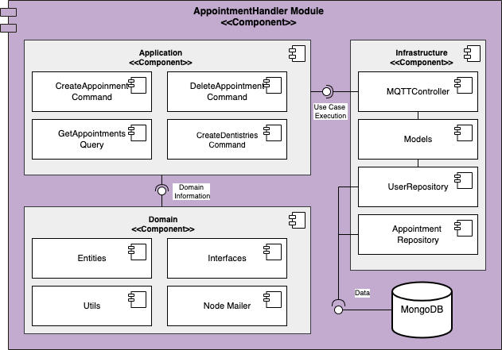

# Appoinment Handler

## Description
Appointment Handler module handles the appointments in the Dentistimo system. It comunicate with through MQTT broker with three other components to:
- Create appointments
- Delete appointments
- Update appointments
- Create dentistry

## Developers
- Oscar Reina Gustafsson
- Aditya Khadkikar
- Anton Golubenko
- Kwabena Asare 
- Andreea Fulger
- Danesh Mohammadi
- Aleksey Zorin
## Installation & run
- npm install 
- cd src/Infrastructure/Controllers
- node Main
## Component Diagram

 
 

### For further information & documentation go to [documentation repository](https://git.chalmers.se/courses/dit355/dit356-2022/t-2/t2-project)

 
 

